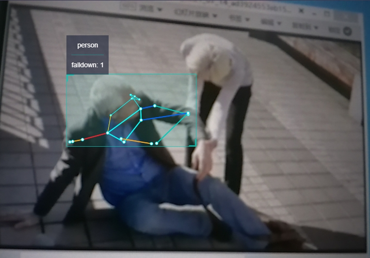

# 功能介绍

hobot_falldown_detection package是订阅ai msg，接收到body_kps数据后判断人体是否摔倒并发布摔倒事件的人体摔倒检测算法示例。
body_kps数据来源于订阅到的ai msg。
摔倒事件使用自定义的hobot ai msg发布出去, 用户可以订阅此topic的ai msg用于应用开发。

# 编译

## 依赖库

ros package：

- ai_msgs

ai_msgs为自定义的消息格式，用于接收body_kps数据，发布推理结果，ai_msgs pkg定义在hobot_msgs中。

### 开发环境

- 编程语言: C/C++
- 开发平台: X3/X86
- 系统版本：Ubuntu 20.0.4
- 编译工具链:Linux GCC 9.3.0/Linaro GCC 9.3.0

### 编译

支持在X3 Ubuntu系统上编译和在PC上使用docker交叉编译两种方式。

#### Ubuntu系统上编译

1、编译环境确认

    - 板端已安装X3 Ubuntu系统。
    - 当前编译终端已设置TogetherROS环境变量：`source PATH/setup.bash`。其中PATH为TogetherROS的安装路径。
    - 已安装ROS2编译工具colcon，安装命令：`pip install -U colcon-common-extensions`

2、编译

- 编译命令：`colcon build --packages-select hobot_falldown_detection`

#### docker交叉编译

1、编译环境确认

- 在docker中编译，并且docker中已经安装好TogetherROS。docker安装、交叉编译说明、TogetherROS编译和部署说明详见机器人开发平台robot_dev_config repo中的README.md。

2、编译

- 编译命令：

  ```
  export TARGET_ARCH=aarch64
  export TARGET_TRIPLE=aarch64-linux-gnu
  export CROSS_COMPILE=/usr/bin/$TARGET_TRIPLE-

  colcon build --packages-select hobot_falldown_detection \
     --merge-install \
     --cmake-force-configure \
     --cmake-args \
     --no-warn-unused-cli \
     -DCMAKE_TOOLCHAIN_FILE=`pwd`/robot_dev_config/aarch64_toolchainfile.cmake
  ```

## 注意事项

# 使用介绍

## 依赖

- mipi_cam package：发布图片msg
- websocket package：渲染图片和ai感知msg
- mono2d_body_detection package：人体kps检测

## 参数

| 参数名         | 解释         | 是否必须   | 默认值        | 备注         |
| ----------- | ---------- | ------ | ---------- | ---------- |
| paramSensivity | 灵敏度 0:ExLow, 1:Low, 2:Middle, 3:High | 否 | 3 |            |
| body_kps_topic_name | 订阅的ksp_point的topic | 否 | hobot_mono2d_body_detection | |
| pub_smart_topic_name | 发布智能结果的topic | 否 | falldown_event     |  |

## 运行

编译成功后，将生成的install路径拷贝到地平线X3开发板上（如果是在X3上编译，忽略拷贝步骤），并执行如下命令运行

### **Ubuntu**

运行方式1，使用ros2 run启动：

```
export COLCON_CURRENT_PREFIX=./install
source ./install/setup.bash

# config中为示例使用的模型，根据实际安装路径进行拷贝
# 如果是板端编译（无--merge-install编译选项），拷贝命令为cp -r install/PKG_NAME/lib/PKG_NAME/config/ .，其中PKG_NAME为具体的package名。

cp -r install/lib/mono2d_body_detection/config/ .

# 启动图片发布pkg
ros2 run mipi_cam mipi_cam --ros-args -p out_format:=nv12 -p image_width:=960 -p image_height:=544 -p io_method:=shared_mem --log-level error &

# 启动jpeg图片编码&发布pkg
ros2 run hobot_codec hobot_codec_republish --ros-args -p channel:=1 -p in_mode:=shared_mem -p in_format:=nv12 -p out_mode:=ros -p out_format:=jpeg -p sub_topic:=/hbmem_img -p pub_topic:=/image_jpeg --ros-args --log-level error &

# 启动单目rgb人体、人头、人脸、人手框和人体关键点检测pkg
ros2 run mono2d_body_detection mono2d_body_detection --ros-args --log-level error &

# 启动web展示pkg
ros2 run websocket websocket --ros-args -p image_topic:=/image_jpeg -p image_type:=mjpeg -p smart_topic:=/hobot_falldown_detection --ros-args --log-level error &

# 启动跌倒检测pkg
ros2 run hobot_falldown_detection hobot_falldown_detection --ros-args  -p paramSensivity:=3 -p body_kps_topic_name:=hobot_mono2d_body_detection -p pub_smart_topic_name:=/hobot_falldown_detection
```

运行方式2，使用launch文件启动：
```
export COLCON_CURRENT_PREFIX=./install
source ./install/setup.bash

# config中为示例使用的模型，根据实际安装路径进行拷贝
# 如果是板端编译（无--merge-install编译选项），拷贝命令为cp -r install/PKG_NAME/lib/PKG_NAME/config/ .，其中PKG_NAME为具体的package名。

cp -r install/lib/mono2d_body_detection/config/ .

# 启动launch文件
ros2 launch install/share/hobot_falldown_detection/launch/hobot_falldown_detection.launch.py

```

### **Linux**
```
export ROS_LOG_DIR=/userdata/
export LD_LIBRARY_PATH=${LD_LIBRARY_PATH}:./install/lib/

# config中为示例使用的模型，根据实际安装路径进行拷贝
cp -r install/lib/mono2d_body_detection/config/ .

# 启动图片发布pkg
./install/lib/mipi_cam/mipi_cam --ros-args -p out_format:=nv12 -p image_width:=960 -p image_height:=544 -p io_method:=shared_mem --log-level error &

# 启动jpeg图片编码&发布pkg
./install/lib/hobot_codec/hobot_codec_republish --ros-args -p channel:=1 -p in_mode:=shared_mem -p in_format:=nv12 -p out_mode:=ros -p out_format:=jpeg -p sub_topic:=/hbmem_img -p pub_topic:=/image_jpeg --ros-args --log-level error &

# 启动web展示pkg
./install/lib/websocket/websocket --ros-args -p image_topic:=/image_jpeg -p image_type:=mjpeg -p smart_topic:=/hobot_falldown_detection --log-level error &

# 启动单目rgb人体、人头、人脸、人手框和人体关键点检测pkg
./install/lib/mono2d_body_detection/mono2d_body_detection --ros-args --log-level error &

# 启动跌倒检测pkg
./install/lib/hobot_falldown_detection/hobot_falldown_detection --ros-args  -p paramSensivity:=3 -p body_kps_topic_name:=hobot_mono2d_body_detection -p pub_smart_topic_name:=/hobot_falldown_detection
```

## 注意事项

第一次运行web展示需要启动webserver服务，运行方法为:

- cd 到websocket的部署路径下：`cd install/lib/websocket/webservice/`（如果是板端编译（无--merge-install编译选项）执行命令为`cd install/websocket/lib/websocket/webservice`）
- 启动nginx：`chmod +x ./sbin/nginx && ./sbin/nginx -p .`

# 结果分析

## web效果展示



